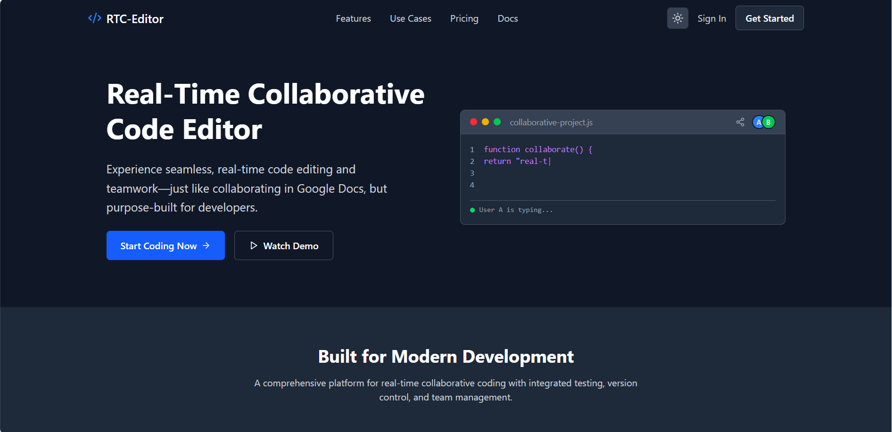
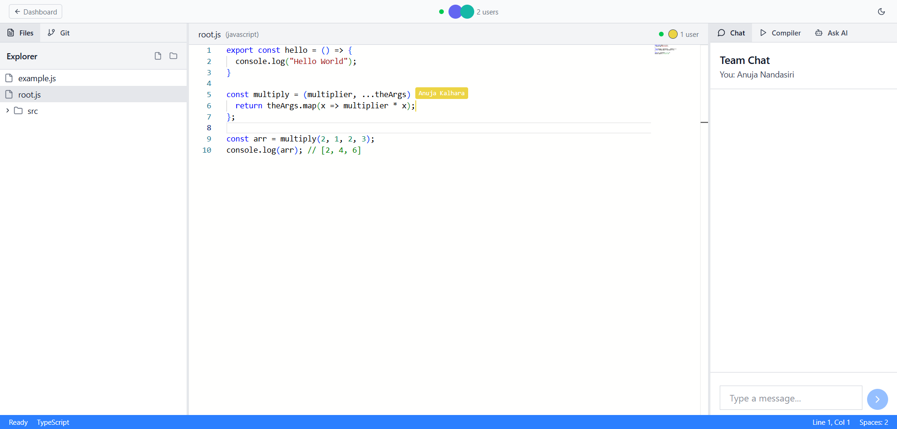
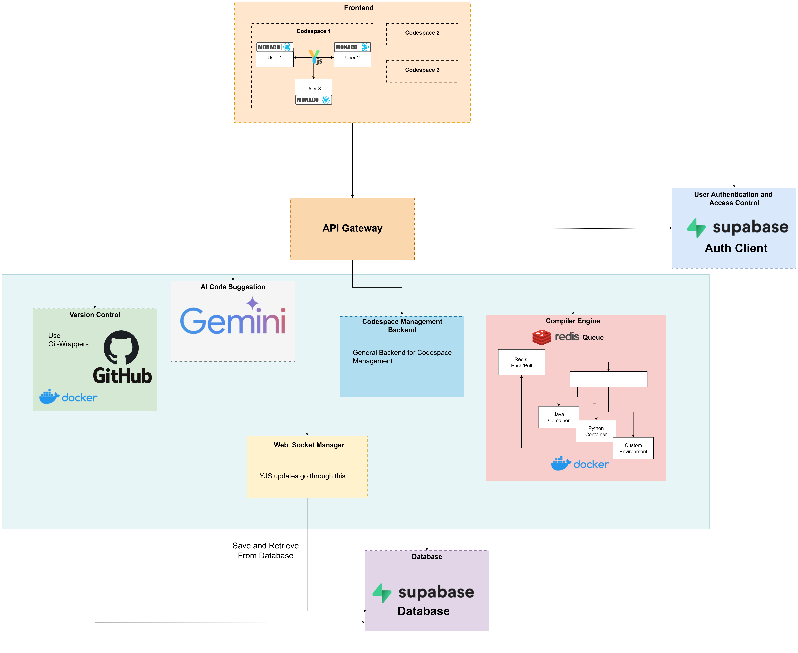

# Real-Time Collaborative Code Editor

**Collaborative Coding, Google Docs Style:**  
Experience seamless, real-time code editing and teamwork—just like collaborating in Google Docs, but purpose-built for developers.

> **Try it Live:**  
> The Real-Time Collaborative Code Editor is cloud hosted and ready to use at [https://rtc-editor.netlify.app/](https://rtc-editor.netlify.app/)





## Overview

### Purpose and Scope

This document provides a high-level introduction to the Realtime Collaborative Code Editor system, covering its purpose, architecture, key components, and technology stack. For detailed information about specific subsystems, refer to:

- **System architecture and microservices design**: System Architecture
- **Frontend application structure and features**: Frontend Application
- **Real-time collaboration mechanisms**: Real-Time Collaboration System
- **Version control implementation**: Version Engine
- **Database schema and storage**: Data Layer

### System Purpose

The Realtime Collaborative Code Editor is a web-based platform enabling simultaneous multi-user code editing with integrated version control, testing capabilities, and role-based access management. The system uses Conflict-free Replicated Data Types (CRDTs) via Yjs to provide Google Docs-style collaboration for software development environments.

**Primary use cases include**:

- Educational institutions conducting interactive coding sessions
- Development teams performing pair programming and code reviews
- Organizations running coding bootcamps and training programs
- Remote teams collaborating across distributed locations

## Key Features

| Feature Category        | Capabilities                                                                                    |
| ----------------------- | ----------------------------------------------------------------------------------------------- |
| Real-Time Collaboration | Simultaneous editing with CRDTs, live cursor tracking, auto-synchronization, integrated chat    |
| Code Editing            | Monaco Editor integration, multi-language support, syntax highlighting, VS Code-like experience |
| Version Control         | Git-like commit/rollback operations, branch management, diff visualization, change tracking     |
| Execution Environment   | Containerized code execution, integrated testing, secure sandboxing, timeout/memory limits      |
| Access Control          | Role-based permissions (Admin/Developer/Learner), workspace management, invitation system       |
| Security                | JWT authentication, isolated Docker containers, rate limiting, request throttling               |

## Architecture Overview

The system implements a microservices architecture with independent, scalable services communicating through HTTP REST APIs, WebSocket connections, and asynchronous message queues.

### Component Architecture Diagram



## Technology Stack

| Layer            | Technologies                                                |
| ---------------- | ----------------------------------------------------------- |
| Frontend         | React 18, TypeScript, Vite, Monaco Editor, Yjs, y-websocket |
| API Gateway      | Express.js, http-proxy-middleware, JWT authentication       |
| Backend Services | Node.js, Express.js, Supabase SDK, Nodemailer               |
| Real-Time Sync   | Yjs (CRDT), WebSocket, y-protocols, lib0                    |
| Version Control  | isomorphic-git, BullMQ (Redis queue), temporary file system |
| Database         | Supabase (PostgreSQL), Redis                                |
| Storage          | Supabase Storage (session files, Git folders)               |
| Authentication   | Supabase Auth, JWT tokens                                   |
| Containerization | Docker, Docker Compose                                      |
| Build Tools      | Vite, Babel, esbuild-wasm                                   |

## Self-Hosting

> Want to host your own instance? We provide comprehensive documentation for self-hosting the Real-Time Collaborative Code Editor.
> <br/>
> **[Complete Self-Hosting Guide](SELF_HOSTING.md)**

The guide covers:

- Environment configuration for all services
- Local development setup
- Docker deployment
- Production deployment checklist
- Security best practices
- Variable reference tables

### Quick Start

```bash
# 1. Clone the repository
git clone https://github.com/AnujaKalahara99/Realtime-Collaborative-Code-Editor.git

# 2. Install dependencies
cd Frontend && npm install
cd ../API_Gateway && npm install
cd ../Codespace_Service && npm install
cd ../WS_Server && npm install

# 3. Configure environment variables (see SELF_HOSTING.md)
# Create .env files in each service directory

# 4. Start all services
npm run dev  # In each service directory

## or you can Ctrl + Shift + P in VSCode and StartAll Servers
```

For detailed configuration instructions, troubleshooting, and production deployment, see [SELF_HOSTING.md](SELF_HOSTING.md).

## Team

**Group ID-18, Project ID-4**

- **Mannage K.M.K.K** - 220384B
- **Nandasiri A.P.K** - 220414U
- **Navodi S.Y.A.C.** - 220419N

**Mentor**: Mr. Oshada Amila

**Built with ❤️ for collaborative development and education**

_Empowering teams to code together, anywhere, anytime._
